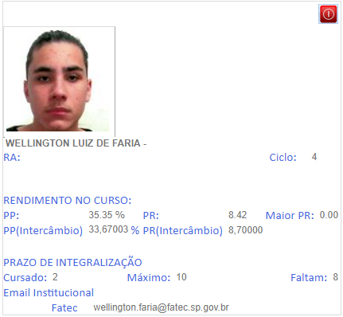
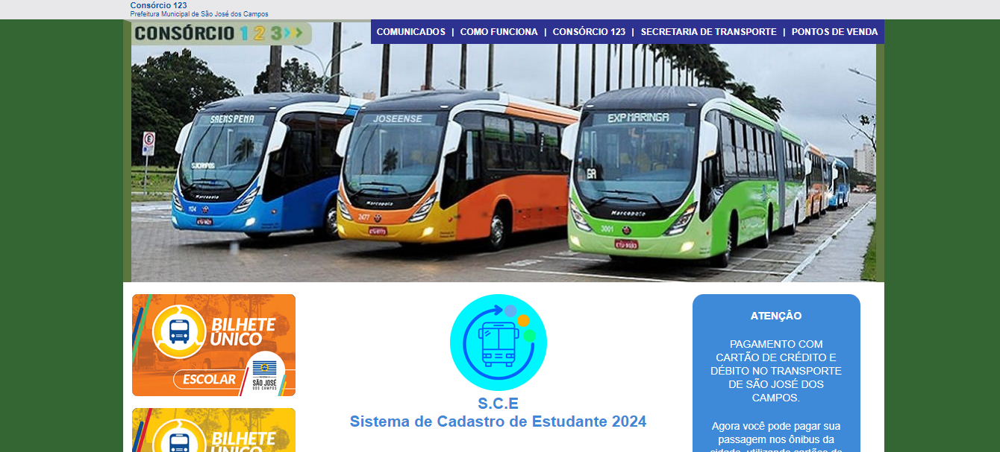
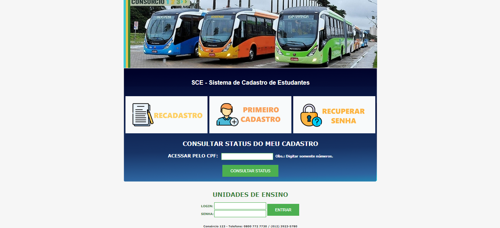
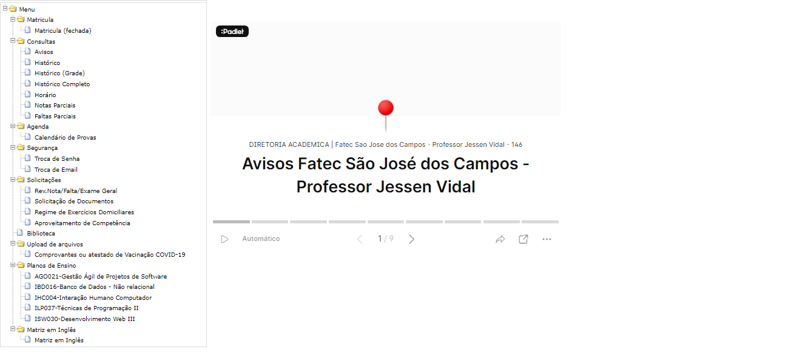
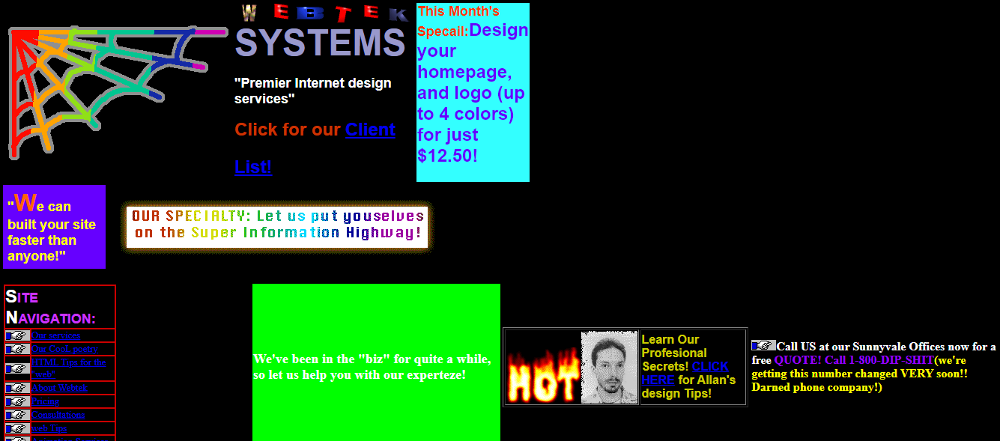
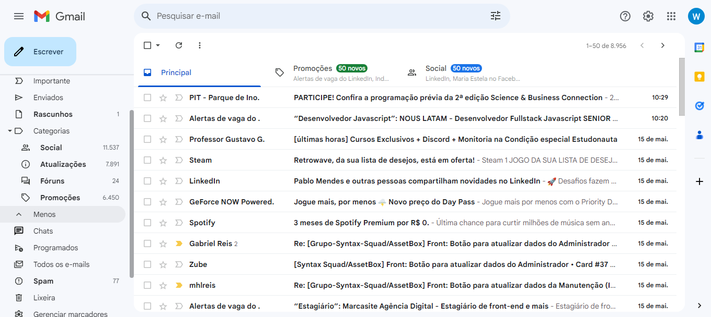
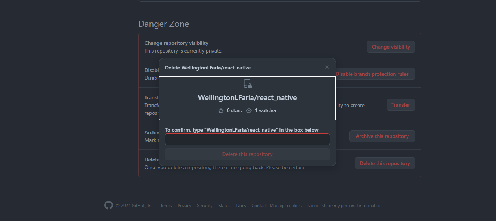

# Atividade das Heurísticas de Usabilidade

Texto que serviu de base para a análise: [https://www.nngroup.com/articles/ten-usability-heuristics](https://www.nngroup.com/articles/ten-usability-heuristics)

## ✖ [Heurística 2 - Correspondência entre o sistema e o mundo real](https://www.nngroup.com/articles/ten-usability-heuristics/#toc-2-match-between-the-system-and-the-real-world-2)

O ícone do botão vermelho no canto superior direito não representa da mehlor forma o botão de deslogar do site.

## ✖ [Heurística 3 - Controle e liberdade do usuário](https://www.nngroup.com/articles/ten-usability-heuristics/#toc-3-user-control-and-freedom-3)

Ao acessar o site Consórcio 123 e clicar para acessar o Sistema de Cadastro de Estudante(S.C.E) não é possível retornar para a tela anterior tirando a liberdade do usuário de navegar pelo sistema.

*Página inicial do Consórcio 123*

*Página Sistema de Cadastro de Estudante(S.C.E)*

## ✖ [Heurística 7 - Flexibilidade e eficiência de uso](https://www.nngroup.com/articles/ten-usability-heuristics/#toc-7-flexibility-and-efficiency-of-use-7)

O menu na esquerda do site reduz a eficiência de uso devido o design escolhido e a falta de uma barra de busca, que interfere diretamente na praticidade de selecionar a opção desejada pelo usuário forçando o mesmo a passar pelas opções até encontrar o que deseja.

## ✖ [Heurística 7 - Flexibilidade e eficiência de uso](https://www.nngroup.com/articles/ten-usability-heuristics/#toc-7-flexibility-and-efficiency-of-use-7)

Não é possível utlizar a tecla enter para terminar de logar no site.

## ✖ [Heurística 8 - Design estético e minimalista](https://www.nngroup.com/articles/ten-usability-heuristics/#toc-8-aesthetic-and-minimalist-design-8)

O site não segue um design estético e minimalista trazendo até mesmo um desconforto ao usuário com fortes contrastes entre as cores.

## ✔ [Heurística 2 - Correspondência entre o sistema e o mundo real](https://www.nngroup.com/articles/ten-usability-heuristics/#toc-2-match-between-the-system-and-the-real-world-2)

Os ícones no canto esquerdo da tela correspondem a linguagem do mundo real. Exemplo: Um bom exemplo é o ícone de lixeira que exclui os emails indesejados pelo usuário.

## ✔ [Heurística 5 - Prevenção de erros](https://www.nngroup.com/articles/ten-usability-heuristics/#toc-5-error-prevention-5)

Para previnir que o usuário delete um repositório sem que seja de sua vontade, o site exige a confirmação do usuário ao requisitar para o mesmo digitar o nome de usuário seguido do nome do repositório.

## ✔ [Heurística 5 - Prevenção de erros](https://www.nngroup.com/articles/ten-usability-heuristics/#toc-5-error-prevention-5)

Para realizar certas ações o site exige que o usuário confirme a ação digitando um código que aparece na tela no telefone celular utilizado como ferramenta de autenticação.

## ✔ [Heurística 9 - Ajuda os usuários a reconhecer, diagnosticar e recuperar-se de erros](https://www.nngroup.com/articles/ten-usability-heuristics/#toc-9-help-users-recognize-diagnose-and-recover-from-errors-9)

O site fornece uma mensagem de erro clara para que o usuário possa contornar o erro, garantindo uma melhor experiência durante o uso do site.

